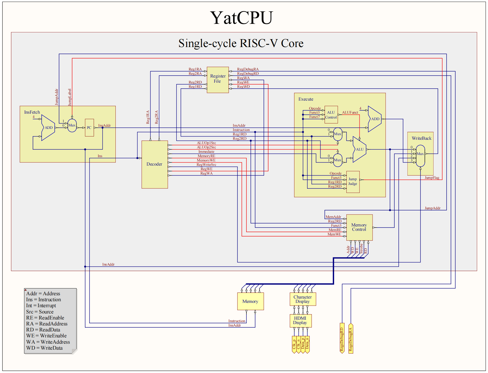
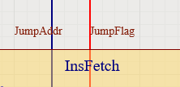

# 实验一 单周期  CPU 

单周期 CPU 一条指令的执行在一个时钟周期内完成。由于时钟周期是固定的，所以执行所有指令都必须和执行最慢指令耗费一样的时间，这导致单周期 CPU 性能很差。单周期 CPU 同一时刻只运行一条指令，指令间不会产生冲突，所以实现起来是最简单的。

本实验的目的是让大家理解 CPU 的基本结构以及 CPU 是如何执行指令的。我们会先向大家介绍一些基本概念，然后会按照指令执行的步骤逐步构造数据通路和控制单元（期间会留有填写代码的任务，请记得完成），最终构造成一个简单的单周期 RISC-V 处理器。


## 单周期 CPU 结构图

数据通路用蓝线标识，控制信号用红线标识。线路和模块的命名和代码有差异。



## 数据通路 

数据在功能部件之间传送的路径称为数据通路。路径上操作或保存数据的部件称为数据通路部件，如 ALU、通用寄存器、内存等。数据通路显示了数据从一个组件流向另一个组件的所有方式。

## 控制信号

顾名思义，控制信号控制数据通路。每当有决定要做出时，控制器单元就必须做出正确的决定并将控制信号发给相应的数据通路部件。例如：ALU 是进行加法还是减法？我们是要从内存中读取还是写入？

那么控制器如何弄清楚需要做什么呢？这完全取决于我们正在执行的指令。在RISC-V指令格式中，控制器通过指令的 `opcode`、`funct3`、`funct7` 字段得知该做出什么决定，从而发出正确的控制信号。 CPU 原理图中的 Decoder、ALUControl、JumpJudge 三个元件都可以看作控制单元。他们接收指令并输出控制信号。控制信号引导数据通过数据路径，以便指令正确执行。

## 组合单元与状态单元

我们知道数字电路里有两大类型的电路，一种是组合逻辑电路，另外一种是时序逻辑电路。在 CPU 设计中，这两种电路构成的单元分别叫做组合单元和状态单元。本实验中只有寄存器属于状态单元（内存不属于 CPU 内核的范畴），其余的均为组合单元。

- 组合单元：输出只取决于当前的输入，并且不需要时钟作为触发条件，输入会立即（不考虑延时）反映到输出
- 状态单元：存储了状态，并且以以时钟作为触发条件，时钟的上升沿到来时输入才会反映到输出


## 实现方式概述

我们设计的 RISC-V CPU 能执行 RISC-V 指令的一个核心子集（RV32I）：

- 算术逻辑指令：`add`、`sub`、`slt` 等
- 存储器访问指令：`lb`、`lw`、`sb` 等
- 分支指令：`beq`、`jar` 等

我们将执行指令分为五个不同的阶段：

- 取指：从内存中获取指令数据
- 译码：弄清楚这条指令的意义，并读取寄存器数据
- 执行：用 ALU 计算结果
- 访存（`load`/`store` 指令）：读写内存
- 回写（除了 `store` 指令外所有指令）：将结果写回寄存器

下面我们先按照上述步骤逐步构建数据通路部件，然后在 CPU 顶层模块将这些数据通路部件实例化并且连接起来。（下面涉及的代码都位于 `lab1/src/main/scala/riscv` 目录下）

### 取指 

代码位于 `core/InstructionFetch.scala`

取指阶段要做的：

- 根据当前 PC 寄存器的地址从内存中取出指令
- 修改 PC 寄存器的值使其指向下一条指令

```scala
  val pc = RegInit(ProgramCounter.EntryAddress)

  when(io.instruction_valid) {
    io.instruction := io.instruction_read_data
    // lab1(InstructionDecode)
    // ...
```


首先 PC 寄存器的值被初始化为程序的入口地址。当指令有效时，先取出当前 PC 指向的指令，然后如果需要跳转则 PC 指向跳转地址，否则指向 PC+4，请你将修改 PC 寄存器的代码补充完整。

!!! note "实验任务"
    请在`core/InstructionFetch.scala` 的 `// lab1(InstructionFetch)` 注释处填入代码，使其能通过 `InstructionFetchTest` 单元测试。

???+tips "无需显式定义时钟信号"
    Chisel 3 默认每个模块都有一个隐藏的时钟信号 `clock`，模块中的每个寄存器都默认使用这个时钟信号。


### 译码

代码位于 `core/InstructionDecode.scala`

译码阶段要做的：

- 读取寄存器操作数以及立即数
- 输出控制信号

```scala
val rs1 = io.instruction(19, 15)
val rs2 = io.instruction(24, 20)

io.regs_reg1_read_address := Mux(opcode === Instructions.lui, 0.U(Parameters.PhysicalRegisterAddrWidth), rs1)
io.regs_reg2_read_address := rs2
```
上面的代码从指令中获取寄存器操作数的编号。除了当指令为 `lui` 时寄存器 1 为 0 号寄存器以外，其他情况寄存器 1 和寄存器 2 编号均分别为指令的 `rs1` 字段（19:15）和 `rs2` 字段（24:20）

???+tips "0 号寄存器"
    为常量 0 单独分配一个寄存器使得 RISC-V ISA 更为简单，例如赋值指令可以用一个操作数为 0 的加法代替。

```scala
val immediate = MuxLookup(
  opcode,
  Cat(Fill(20, io.instruction(31)), io.instruction(31, 20)),
  IndexedSeq(
    InstructionTypes.I -> Cat(Fill(21, io.instruction(31)), io.instruction(30, 20)),
    InstructionTypes.L -> Cat(Fill(21, io.instruction(31)), io.instruction(30, 20)),
    // ...
```

上面的代码获取立即数。由于不同指令类型立即数的位置不同，所以要利用 `opcode` 区分指令类型，然后获取对应位置的立即数。

```scala
object ALUOp1Source {
  val Register = 0.U(1.W)
  val InstructionAddress = 1.U(1.W)
}
// ...

io.ex_aluop1_source := Mux(
  opcode === Instructions.auipc || opcode === InstructionTypes.B || opcode === Instructions.jal,
  ALUOp1Source.InstructionAddress,  
  ALUOp1Source.Register
)
```
以 `ex_aluop1_source` 控制信号为例。该控制信号控制 ALU 的第一个操作数的输入。通过 `opcode` 识别指令类型，从而为 `ex_aluop1_source` 赋值。当指令类型属于 `auipc`、`jal` 或 B 类时，`ex_aluop1_source` 置为 `0`，控制 ALU 第一个操作数的输入为指令地址；其他情况 `ex_aluop1_source` 置为 `1`，控制 ALU 第一个操作数的输入为寄存器。

可见译码单元的设计也是很简单的组合逻辑，知晓控制信号与指令的映射关系即可完成。下面请同学们补充为 `ex_aluop2_source`、`io.memory_read_enable`、`io.memory_write_enable`、`io.wb_reg_write_source` 四个控制信号赋值的代码。

| 控制信号      | 含义 |
| ----------- | ----------- |
| `ex_aluop2_source`  | ALU 输入来源选择  |
| `memory_read_enable`   |   内存读使能 |
| `memory_write_enable` |   内存写使能 |
| `wb_reg_write_source` |   写回数据来源选择    |

!!! note "实验任务"
    请在`core/InstructionDecode.scala` 的 `// lab1(InstructionDecode)` 注释处填入代码，使其能通过 `InstructionDecoderTest` 单元测试。


### 执行

代码位于 `core/Execute.scala` 

执行阶段要做的是：

- 进行ALU计算
- 判断是否跳转

```scala
val alu = Module(new ALU)
val alu_ctrl = Module(new ALUControl)
// ...
io.mem_alu_result := alu.io.result
```
上面的代码在 `Execute` 模块内实例化了 `ALU` 和 `ALUcontrol`。具体的 ALU 计算逻辑在 `ALU` 模块进行，此处只需你在 `Execute` 模块内为 `ALU` 的输入端口赋值。`ALU` 的代码位于`core/ALU.scala`。

!!! note "实验任务"
    请在`core/Execute.scala` 的 `// lab1(Execute)` 注释处填入代码，使其能通过 `ExecuteTest` 单元测试。

```scala
io.if_jump_flag := 
  (opcode === Instructions.jal) ||
  (opcode === Instructions.jalr) ||
  (opcode === InstructionTypes.B) && 
  MuxLookup(
    funct3,
    false.B,
    IndexedSeq(
      InstructionsTypeB.beq -> (io.reg1_data === io.reg2_data),
      // ...
```

上面的代码判断是否跳转。判断是否跳转的逻辑是：如果是无条件跳转指令则直接跳转（上面代码中的 `jal`、`jalr` 指令），如果是分支指令则根据相应的跳转条件判断是否跳转（例如上面代码中的 `beq` 指令，当 `io.reg1_data === io.reg2_data` 时跳转）。跳转时将控制信号 `if_jump_flag` 置 `1`。


### 访存

代码位于 `core/MemoryAccess.scala`

只有 `load`/`store` 指令有访存阶段。访存阶段，读取是将内存中的数据赋给寄存器，写入反之。

在译码阶段，如果是 L 型指令，`memory_read_enable` 被置 `1`；如果是 S 型指令，`memory_write_enable` 被置 `1`。这两个控制信号决定了本阶段是进行读取还是写入。

```scala
val mem_address_index = io.alu_result(log2Up(Parameters.WordSize) - 1, 0).asUInt
```

首先获取读写内存的地址。

```scala
when(io.memory_read_enable) {
  val data = io.memory_bundle.read_data
  io.wb_memory_read_data := MuxLookup(
    io.funct3,
    0.U,
    IndexedSeq(
      InstructionsTypeL.lb -> MuxLookup(
        mem_address_index,
        Cat(Fill(24, data(31)), data(31, 24)),
        IndexedSeq(
          0.U -> Cat(Fill(24, data(7)), data(7, 0)),
          1.U -> Cat(Fill(24, data(15)), data(15, 8)),
          2.U -> Cat(Fill(24, data(23)), data(23, 16))
        )
      ),
      InstructionsTypeL.lbu -> MuxLookup(
      // ...
```

上面的代码用于读取内存。首先从总线读取数据 `data`，然后根据指令的不同对数据进行不同的处理（例如 `lb` 指令进行符号扩展，`lbu` 指令进行 0 扩展，`lh` 读取双字节等）并赋给 `io.wb_memory_read_data`，用于写回。

```scala
.elsewhen(io.memory_write_enable) {
    io.memory_bundle.write_data := io.reg2_data
    io.memory_bundle.write_enable := true.B
    io.memory_bundle.write_strobe := VecInit(Seq.fill(Parameters.WordSize)(false.B))
    when(io.funct3 === InstructionsTypeS.sb) {
      io.memory_bundle.write_strobe(mem_address_index) := true.B
      io.memory_bundle.write_data := io.reg2_data(Parameters.ByteBits, 0) << (mem_address_index << log2Up(Parameters.ByteBits).U)
    }.elsewhen(io.funct3 === InstructionsTypeS.sh) {
    // ...
```

上面的代码用于写入内存。根据指令的不同，写入的数据会经过不同的处理（`sw` 取 32 位、`sh` 取 16 位、`sb` 取 8 位）。


### 写回

代码位于 `core/WriteBack.scala` 

写回阶段，将计算得到的数据或内存读取的数据写入寄存器。

写回模块只是一个多路选择器，代码非常简单，不再赘述。不过请你思考一个问题：写使能信号在译码阶段就产生了，此时正确的写回数据还没有算出（或从内存读出），那么错误的写回数据会被写入寄存器堆吗？为什么？

## 组合成 CPU 

代码位于 `core/CPU.scala`

我们已经实现了构建 CPU 所需要的所有部件。下面我们需要按照单周期 CPU 结构图将上面的部件实例化并且连接起来。

```scala
class CPU extends Module {
  val io = IO(new CPUBundle)
```
CPUBundle 是 CPU 和内存等外设进行数据交换的通道。

```scala
  val regs = Module(new RegisterFile)
  val inst_fetch = Module(new InstructionFetch)
  val id = Module(new InstructionDecode)
  val ex = Module(new Execute)
  val mem = Module(new MemoryAccess)
  val wb = Module(new WriteBack)
```

这里实例化了不同执行阶段的各个模块。

```scala
  inst_fetch.io.jump_address_id := ex.io.if_jump_address
  inst_fetch.io.jump_flag_id := ex.io.if_jump_flag
```
以上面两个线路为例，大家在 CPU 原理图中可以看到相应的线路。



请你观察 `Execute` 模块输入端口代码以及 CPU 结构图，填写 `Execute` 模块的输入与其他模块输出的连线。

!!! note "实验任务"
    请在 `core/CPU.scala` 的 `// lab1(CPU)` 注释处填入代码，并在lab1下运行 `sbt test`。

`sbt test` 会执行包括 CPUTest 以及上述所有单元测试，这一步完成后我们就成功构造出了一个 RISC-V 单周期 CPU 了!

## 使用自定义应用测试

参考[编译和链接的过程](../tutorial/compile-and-link.md)以及[CMake 入门](../tutorial/cmake.md)，编写并编译自己的程序后，修改 `CPUTest` 中的 `InstructionROM` 的指令文件地址，即可运行你自己的程序。

如果想要烧录自己的程序到 FPGA 板子上，只需要修改 `board/<板子型号>/Top.scala` 中的 `binaryFilename` 为你生成的程序二进制文件名即可。

## 提交 Autograder

完成以上所有实验并通过相应测试后，请将以下文件打包为 `.zip` 文件，并上传到 Autograder 进行进一步的测试：

- `src/main/scala/riscv/core/ProgramCounter.scala`
- `src/main/scala/riscv/core/InstructionDecode.scala`
- `src/main/scala/riscv/core/RegisterFile.scala`
- `src/main/scala/riscv/core/ALU.scala`

请确保 Autograder 提交界面显示的完整文件路径包含上述文件路径且完全一致。多余的文件可以上传但将被忽略。
