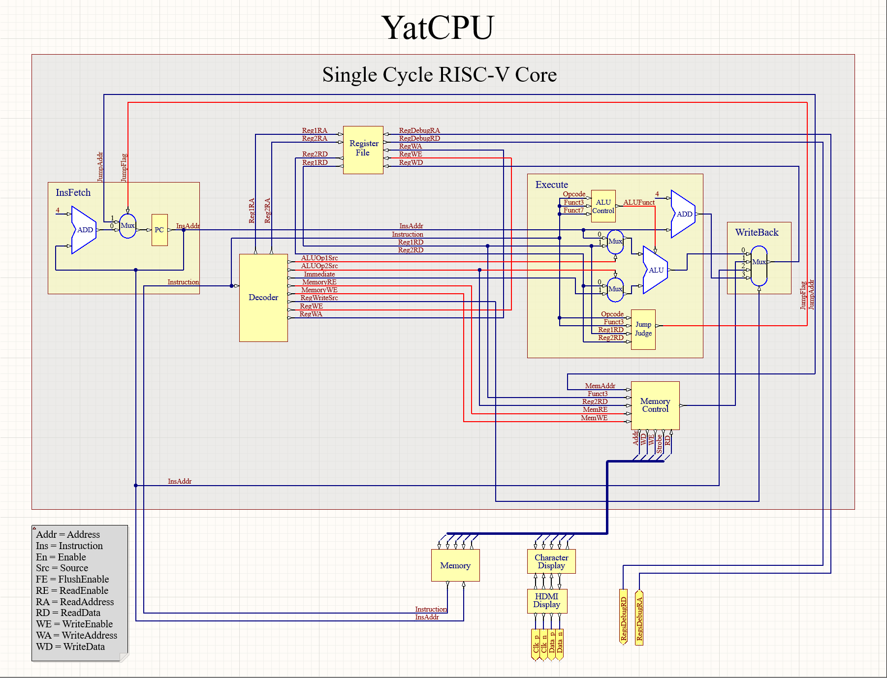

# 实验一 单周期 CPU

单周期CPU一条指令的执行在一个时钟周期内完成。

由于时钟周期是固定的，所以执行所有指令都必须和执行最慢指令耗费一样的时间，这导致单周期cpu性能很差。单周期cpu同一时刻只运行一条指令，指令间不会产生冲突，所以实现起来是最简单的。

本实验的目的是让大家理解cpu的基本结构以及cpu是如何执行指令的。我们会先向大家介绍一些基本概念，然后会结合代码细致说明指令执行的步骤（期间会留有填写代码的任务，请记得完成）。


## 单周期cpu结构图

数据通路用蓝线标识，控制信号用红线标识。线路和模块的命名和代码有差异。



## 数据通路 

数据在功能部件之间传送的路径称为数据通路。路径上执行必要功能的部件称为数据通路部件，如ALU、通用寄存器、内存等。

数据通路显示了数据从一个组件流向另一个组件的所有方式。

## 控制信号

顾名思义，控制信号控制数据通路。每当有决定要做出时，控制器就必须做出正确的决定并将控制信号发给相应的数据通路部件。例如：alu是进行加法还是减法？我们是要从内存中读取还是写入？

那么控制器如何弄清楚需要做什么呢？这完全取决于我们正在执行的指令。在RISC-V指令格式中，控制器通过指令的opcode、funct3、funct7字段得知该做出什么决定，从而发出正确的控制信号。

cpu原理图中的Decoder、ALUControl、JumpJudge三个原件都可以看作控制器。他们接收指令并输出控制信号。

控制信号引导数据通过数据路径，以便指令正确执行。

## 组合逻辑与时序逻辑

我们知道数字电路里有两大类型的电路，一种是组合逻辑电路，另外一种是时序逻辑电路。

在cpu设计中，这两种电路的不同之处体现在：组合逻辑电路不需要时钟作为触发条件，因此输入会立即(不考虑延时)反映到输出。时序逻辑电路以时钟作为触发条件，时钟的上升沿到来时输入才会反映到输出。本实验中只有寄存器属于时序电路，其余的均为组合逻辑。

组合逻辑有时会造成竞争和冒险。

- 竞争：在组合电路中，信号经由不同的途径达到某一会合点的时间有先有后，这种现象称为竞争。

- 冒险：由于竞争而引起电路输出发生瞬间错误现象称为冒险。表现为输出端出现了原设计中没有的窄脉冲，常称其为毛刺。

在完成本实验后，请大家思考一个问题：在add指令中，寄存器堆写使能控制信号在译码阶段被置1，这时add的计算结果还没出来，那么寄存器堆是否会被写入错误数据？如果会，那么为什么指令的执行却没有出错呢？


## 执行指令的步骤

一般来说执行一条指令最多需要五个步骤：

- 取指：从内存中获取指令数据。
- 译码：弄清楚这条指令的意义，并读取寄存器数据。
- 执行：用ALU计算结果。
- 访存（load/store指令）：读写内存。
- 回写（部分指令）：将结果写回寄存器。

下面我们结合代码对每个步骤进行分析。(下面涉及的代码都位于 `lab1/src/main/scala/riscv` 目录下)

### 取指 

代码位于 `core/InstructionFetch.scala`

取指阶段，在时钟上升沿到来时pc寄存器的值发生变化，从而在内存中读出下一条指令。

```
val pc = RegInit(ProgramCounter.EntryAddress)
```
首先pc寄存器的值被初始化为程序的入口地址。

```
when(io.instruction_valid) {
  when(io.jump_flag_id){
    pc := io.jump_address_id
  }.otherwise {
    pc := pc + 4.U
  }
  io.instruction := io.instruction_read_data
}.otherwise{
  pc := pc
  io.instruction := 0x00000013.U
}
io.instruction_address := pc
```

指令有效时，如果需要跳转则pc指向跳转地址，否则pc+4（指向下一条指令）。

值得注意的是，如果没有pc寄存器的话就无法利用时钟驱动指令的执行。

???+tips "clk"
    chisel 3每个模块都有一个隐藏的时钟信号，模块中的每个寄存器都使用这个时钟信号


## 译码

代码位于 `core/InstructionDecode.scala`

译码阶段要做的是：

- 读取寄存器操作数以及立即数

- 输出控制信号

```
val rs1 = io.instruction(19, 15)
val rs2 = io.instruction(24, 20)

io.regs_reg1_read_address := Mux(opcode === Instructions.lui, 0.U(Parameters.PhysicalRegisterAddrWidth), rs1)
io.regs_reg2_read_address := rs2
```
上面的代码从指令中获取寄存器操作数的编号。除了当指令为lui时寄存器1为0号寄存器以外，其他情况寄存器1和寄存器2编号均分别为指令的rs1字段(19:15)和rs2字段（24:20）

???+tips "0号寄存器"
    为常量 0 单独分配一个寄存器使得 RISC-V ISA 更为简单，例如赋值指令可以用一个操作数为0的加法代替。

```
val immediate = MuxLookup(
  opcode,
  Cat(Fill(20, io.instruction(31)), io.instruction(31, 20)),
  IndexedSeq(
    InstructionTypes.I -> Cat(Fill(21, io.instruction(31)), io.instruction(30, 20)),
    InstructionTypes.L -> Cat(Fill(21, io.instruction(31)), io.instruction(30, 20)),
    ...
```
上面的代码获取立即数。由于不同指令类型立即数的位置不同，所以要利用opcode区分指令类型，然后获取对应位置的立即数。

后面的代码则是为控制信号赋值。以 ex_aluop1_source 控制信号为例。该控制信号控制ALU的第一个操作数的输入。当ex_aluop1_source为0时，ALU的第一个操作数为rs1寄存器的值。当ex_aluop1_source为1时，ALU的第一个操作数为指令地址。

```
io.ex_aluop1_source := Mux(
  opcode === Instructions.auipc || opcode === InstructionTypes.B || opcode === Instructions.jal,
  ALUOp1Source.InstructionAddress,  
  ALUOp1Source.Register
)
```
上面的代码表示，当指令的opcode字段显示该指令属于Btype，或者该指令是jal，又或者该指令是auipc时，将ex_aluop1_source赋值为1(ALUOp1Source.InstructionAddress)。否则赋值为0(ALUOp1Source.Register)。

可见译码单元的设计也是很简单的组合逻辑，下面请同学们补充为 `ex_aluop1_source`、`io.memory_read_enable`、`io.memory_write_enable`、`io.wb_reg_write_source` 四个控制信号赋值的代码。

> 任务：请在`core/InstructionDecode.scala` 的 `// lab1 InstructionDecode` 注释处填入代码，使其能通过 `InstructionDecoderTest`


## 执行

代码位于 `core/Execute.scala` 

执行阶段要做的是：
- 进行ALU计算
- 判断是否跳转

```
val alu = Module(new ALU)
val alu_ctrl = Module(new ALUControl)
...
io.mem_alu_result := alu.io.result
```
上面的代码在Execute模块内实例化了ALU和ALUcontrol。具体的ALU计算逻辑在ALU模块进行，此处只需同学们在Execute模块内为ALU的输入端口赋值。（ALU的代码位于core/ALU.scala）

> 任务：请在`core/Execute.scala` 的 `// lab1 Execute` 注释处填入代码，使其能通过 `ExecuteTest`

```
io.if_jump_flag := 
  (opcode === Instructions.jal) ||
  (opcode === Instructions.jalr) ||
  (opcode === InstructionTypes.B) && 
  MuxLookup(
    funct3,
    false.B,
    IndexedSeq(
      InstructionsTypeB.beq -> (io.reg1_data === io.reg2_data),
      ...
```

上面的代码判断是否跳转。判断是否跳转的逻辑是：如果是无条件跳转指令则直接跳转（上面代码中的jal、jalr指令），如果是分支指令则根据相应的跳转条件判断是否跳转（例如上面代码中的beq指令，当io.reg1_data === io.reg2_data时跳转）。跳转时将控制信号if_jump_flag置1。


## 访存

代码位于 `core/MemoryAccess.scala`

只有load/store指令有访存阶段。访存阶段，读取或写入内存（读取是将内存中的数据赋给寄存器，写入反之）。

在译码阶段，如果是l型指令，memory_read_enable被置1；如果是S型指令，memory_write_enable被置1。这两个控制信号决定了本阶段是进行读取还是写入。

```
val mem_address_index = io.alu_result(log2Up(Parameters.WordSize) - 1, 0).asUInt
```
这里获取读写内存的地址。

```
when(io.memory_read_enable) {
  val data = io.memory_bundle.read_data
  io.wb_memory_read_data := MuxLookup(
    io.funct3,
    0.U,
    IndexedSeq(
      InstructionsTypeL.lb -> MuxLookup(
        mem_address_index,
        Cat(Fill(24, data(31)), data(31, 24)),
        IndexedSeq(
          0.U -> Cat(Fill(24, data(7)), data(7, 0)),
          1.U -> Cat(Fill(24, data(15)), data(15, 8)),
          2.U -> Cat(Fill(24, data(23)), data(23, 16))
        )
      ),
      InstructionsTypeL.lbu -> MuxLookup(
      ...
```
上面的代码用于读取内存。首先从总线读取数据data，然后根据指令的不同对数据进行不同的处理（例如lb指令进行符号扩展，lbu指令进行0扩展，lh读取双字节等）并赋给io.wb_memory_read_data，用于写回。下面请同学们填写lh指令对数据进行处理的代码。

> 任务：请在`core/MemoryAccess.scala` 的 `// lab1 MemoryAccess` 注释处填入代码，使其能通过 `MemoryAccessTest`

```
.elsewhen(io.memory_write_enable) {
    io.memory_bundle.write_data := io.reg2_data
    io.memory_bundle.write_enable := true.B
    io.memory_bundle.write_strobe := VecInit(Seq.fill(Parameters.WordSize)(false.B))
    when(io.funct3 === InstructionsTypeS.sb) {
      io.memory_bundle.write_strobe(mem_address_index) := true.B
      io.memory_bundle.write_data := io.reg2_data(Parameters.ByteBits, 0) << (mem_address_index << log2Up(Parameters.ByteBits).U)
    }.elsewhen(io.funct3 === InstructionsTypeS.sh) {
    ...
```

上面的代码用于写入内存。根据指令的不同，写入的数据会经过不同的处理（sw取32位、sh取16位、sb取8位）。


## 写回

代码位于 `core/WriteBack.scala`

写回阶段，将计算得到的数据或内存读取的数据写入寄存器。

写回阶段的代码逻辑简单，不在此赘述。

## 提交 Autograder

完成以上所有实验并通过相应测试后，请将以下文件打包为 `.zip` 文件，并上传到 Autograder 进行进一步的测试：

- `src/main/scala/riscv/core/ProgramCounter.scala`
- `src/main/scala/riscv/core/InstructionDecode.scala`
- `src/main/scala/riscv/core/RegisterFile.scala`
- `src/main/scala/riscv/core/ALU.scala`

请确保 Autograder 提交界面显示的完整文件路径包含上述文件路径且完全一致。多余的文件可以上传但将被忽略。


