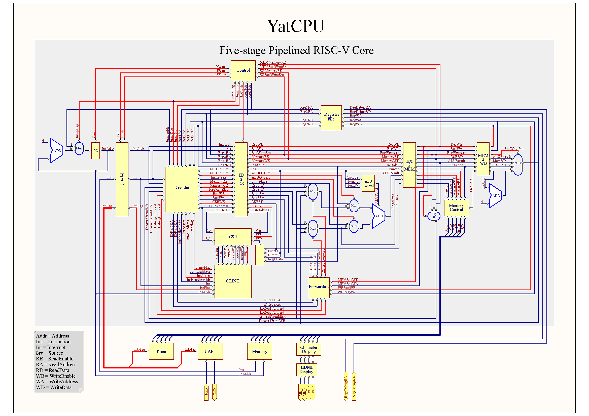

# 流水线 CPU

在完成单周期 CPU 实验后，你已经对 CPU 的原理和结构已经有了基本的了解。但单周期的 CPU 设计中，关键路径太长，频率难以提升，并且每个时钟周期只能执行一条指令，指令吞吐率低。下面，我们将尝试使多条指令重叠执行（即流水线技术）来解决这个问题。

竞争冒险的处理是流水线 CPU 设计的难点和关键所在。在下面的实验中，我们首先设计一个简单的三级流水线 CPU（IF、ID 和 EX 三级），它只涉及分支和跳转指令带来的控制冒险，处理起来较为简单；然后，我们再将三级流水线 CPU 的 EX 级继续切分为 EX、MEM 和 WB，形成经典的五级流水线，这样做带来的数据冒险需要使用阻塞和转发技术进行处理；最后，我们将分支和跳转提前到 ID 阶段，进一步缩短分支延迟。

本实验中五级流水线 CPU 的架构与 *Computer Organization and Design, RISC-V Edition* 中的流水线 CPU 架构基本相同，读者可同时参考此书第 4.5~4.8 节。

在本实验中，你将学习到：

- 使用流水线设计缩短关键路径
- 正确处理流水线阻塞与清空
- 使用转发逻辑减少流水线阻塞

## 流水线寄存器

流水线寄存器是在流水线中起缓存作用的寄存器，目的是切分组合逻辑，缩短关键路径。它的基本功能非常简单，在每一个时钟周期，根据复位（流水线清空）或阻塞（流水线暂停）的状态，将寄存器内容清空、保持或设置为新的值。寄存器的输出则是寄存器中保存的值。为了方便复用，我们可以定义一个带参数的 `PipelineRegister` 模块，用来实现不同数据位宽的流水线寄存器。

实验代码已经在 `src/main/scala/riscv/core/PipelineRegister.scala` 中定义好了模块接口：`stall` 和 `flush` 分别为流水线寄存器的阻塞和清空信号，`in` 和 `out` 分别为要写入寄存器的值和寄存器的当前值。请你修改 `// Lab3(PipelineRegister)` 注释处的代码，使其能通过 `PipelineRegisterTest` 测试。

!!! tips "提示"
    在完成此题时你可以暂时抛开 CPU，只需要用实验零中的基础知识完成上述功能即可，所需代码不超过 7 行，请将它当作一道简单的开胃菜享用吧！

## 三级流水线

下面是三级流水线 CPU 的结构图，数据通路用蓝线表示，控制信号用红线表示。


我们用 `IF2ID` 和 `ID2EX` 这两组流水线寄存器将单周期 CPU 的组合逻辑部分切分为三个阶段：

* 取指（Instruction Fetch，IF）：根据 PC 中的指令地址从内存中取出指令码；
* 译码（Instruction Decode，ID）：将指令码解码为控制信号并从寄存器组中读取操作数；
* 执行（Execute，EX）：包括 ALU 运算、访问内存和结果写回。

这三个阶段的代码与单周期 CPU 大同小异，所以我已经帮你写好啦，接下来让我们把主要精力放在处理竞争冒险上。

### 解决控制冒险：清空

在三级流水线中，由于所有数据处理操作都在 EX 阶段进行，因此不存在数据冒险，我们只需要处理程序跳转带来的控制冒险。有三种情况可能发生程序跳转：

* EX 段执行到跳转指令
* EX 段执行到分支指令且分支条件成立
* 发生中断，EX 段收到 CLINT 发来的 `InterruptAssert` 信号，这相当于在 EX 段的指令之上叠加了一条跳转指令，EX 段的指令继续执行，IF 段和 ID 段的指令将被丢弃

无论哪种情况，都是由 EX 段向 IF 段发送跳转信号 `jump_flag` 和跳转的目标地址 `jump_address`，但在 `jump_address` 写入 PC 并从该处取出指令前，流水线的 IF 和 ID 段已经各有两条不需要执行的指令，好在这两条指令的结果还没有写回，我们只需要清空对应的流水线寄存器，把它们变成两条空指令即可。

我们用一个控制单元来检测控制冒险并清空流水线，模块定义在 `src/main/scala/riscv/core/threestage/Control.scala`，为了避免此题过于简单，我们没有提供模块接口，请根据以上分析确定模块的输入输出，在 `// Lab3(Flush)` 处将代码补充完整，并在 `src/main/scala/riscv/core/threestage/CPU.scala` 的 `// Lab3(Flush)` 处补充相关连线，使其能够通过 `ThreeStageCPUTest` 测试。

## 五级流水线

在三级流水线中，执行阶段逻辑复杂，仍然可能导致较大的延迟。为了进一步缩短关键路径，我们可以扩展流水线级数，将执行阶段进一步分为 ALU 阶段、访存阶段以及写回阶段，如下图所示。



把三级流水线进一步分割为五级流水线将带来更加复杂的数据冒险，下面我们将尝试使用阻塞的方式解决数据冒险，得到一个功能完整的五级流水线 CPU。接着我们可以使用旁路和将分支跳转提前到 ID 阶段进一步提升 CPU 效率，这两部分将作为拓展实验供同学们选做。注意，上面的 CPU 结构图是我们完成所有实验之后的结果，在完成“缩短分支延迟”实验之前，我们 CPU 的结构将与上图稍有不同。例如，我们紧接着讨论的五级流水线 CPU 在 EX 阶段判断程序是否发生跳转，而不是 ID 阶段。

### 解决数据冒险：阻塞

当处于 ID 阶段的指令要读取的寄存器依赖于 EX 或 MEM 阶段的指令时，发生数据冒险。此时，我们可以保持 IF 和 ID 两个阶段状态不变，直到被依赖的指令执行完成，即 ID 段能够从寄存器组获得它所需要的数据，再继续执行。让我们考虑如下指令序列，并思考几个问题：

```assembly
0000: add x1, x0, x0
0004: sub x2, x0, x1
0008: and x3, x1, x2
000C: jalr x4, x1, 0
0010: or x5, x3, x4
0014: xor x6, x4, x5
```

假设没有阻塞，它们在流水线中的状态如下：

| 时钟周期 |   0   |   1   |   2   |   3    |   4    |   5    |   6    |
| :------: | :---: | :---: | :---: | :----: | :----: | :----: | :----: |
|  **IF**  | `add` | `sub` | `and` | `jalr` |  `or`  | `xor`  |        |
|  **ID**  |       | `add` | `sub` | `and`  | `jalr` |  `or`  | `xor`  |
|  **EX**  |       |       | `add` | `sub`  | `and`  | `jalr` |  `or`  |
| **MEM**  |       |       |       | `add`  | `sub`  | `and`  | `jalr` |
|  **WB**  |       |       |       |        | `add`  | `sub`  | `and`  |

1. 在第 2 个时钟周期，指令 `sub x2, x0, x1` 处于 ID 阶段，需要从寄存器组读出它的源操作数，但它的源操作数依赖于前一条指令，且前一条指令的结果还没有写回，需要阻塞；同理，在第 3 个时钟周期，指令 `and x3, x1, x2` 需要读取的源操作数依赖于前两条指令，也需要阻塞；但是这两条指令分别需要阻塞多少个时钟周期？
2. 在第 4 个时钟周期，指令 `jalr x4, x1, 0` 处于 ID 阶段，它的源操作数依赖于处于 WB 阶段的指令的结果，此时需不需要阻塞？
3. 最后两条指令的源操作数同样依赖于前面的指令，这两条指令需不需要阻塞？

请你先思考片刻，下面我将给出阻塞后的流水线状态并作分析：

| 时钟周期 |   0   |   1   |   2   |     3     |     4     |   5    |     6     |     7     |   8    |   9    |    10     |
| :------: | :---: | :---: | :---: | :-------: | :-------: | :----: | :-------: | :-------: | :----: | :----: | :-------: |
|  **IF**  | `add` | `sub` | `and` |   `and`   |   `and`   | `jalr` |  `jalr`   |  `jalr`   |  `or`  | `xor`  |   `add`   |
|  **ID**  |       | `add` | `sub` |   `sub`   |   `sub`   | `and`  |   `and`   |   `and`   | `jalr` |  `or`  | **`nop`** |
|  **EX**  |       |       | `add` | **`nop`** | **`nop`** | `sub`  | **`nop`** | **`nop`** | `and`  | `jalr` | **`nop`** |
| **MEM**  |       |       |       |   `add`   |   `nop`   | `nop`  |   `sub`   |   `nop`   | `nop`  | `and`  |  `jalr`   |
|  **WB**  |       |       |       |           |   `add`   | `nop`  |   `nop`   |   `sub`   | `nop`  | `nop`  |   `and`   |

位于 ID 阶段的指令和位于 WB 阶段的指令之间不会发生数据冒险，这是因为我们的寄存器组模拟实现了 Double Pumping 功能，即 WB 阶段在前半个时钟周期向寄存器组写入数据，ID 阶段在后半个时钟周期从寄存器组读出数据，请你打开 `src/main/scala/riscv/core/RegisterFile` 查看相关代码。因此，在上面的例子中，对 `sub` 和 `and` 指令的阻塞只需持续到它们依赖的指令进入 WB 阶段即可，而 `jalr` 指令无需阻塞。值得注意的是，我们在阻塞 PC 和 IF2ID 寄存器以保持 IF 和 ID 阶段不变的同时，需要清空 ID2EX 寄存器以在 EX 阶段插入空指令（“气泡”），否则 ID 阶段的指令还是会进入 EX 阶段，这样就不是“阻塞”，而变成“重复”了。另外，`jalr` 是跳转指令，虽然它后面两条指令依赖于它写入的寄存器，但是它们本就不应该紧接着被执行，而是应该被清空，所以在第 10 个时钟周期应该清空 IF2ID 和 ID2EX 寄存器，而不是阻塞。（上表中加粗的 `nop` 表示因清空信号而插入的空指令，未加粗的 `nop` 表示从上一个流水段进入下一个流水段的空指令。）

特别提示：除了以上讨论的情况之外，寄存器 `x0` 在 risc-v 中具有特殊作用，以它为目标寄存器的指令的结果将被丢弃，也就是说，只依赖于 `x0` 的指令并不需要阻塞。

我们用一个控制单元来检测并解决控制冒险和数据冒险，模块接口已经定义在 `src/main/scala/riscv/core/fivestage_stall/Control.scala`，请根据以上分析，修改 `// Lab3(Stall)` 处的代码，使其能够通过 `FiveStageCPUStallTest` 测试。

### 拓展：使用旁路减少阻塞

至此，我们已经解决完所有竞争冒险，做出一个功能基本完整的五级流水线 CPU 了！但是，对同一个寄存器的连续操作在程序中是非常常见的，如果只使用阻塞来解决数据冒险，将产生大量“气泡”，降低执行效率。实际上，我们可以直接从流水线寄存器中直接获得指令的执行结果，并不需要阻塞直到前面的指令把结果写入寄存器组后再从寄存器组读取，即在 EX 段和 EX2MEM、MEM2WB 这两组流水线寄存器之间建立“旁路”，让 EX 段可以直接获取前面指令的执行结果。我们考虑如下指令序列：

```assembly
0000: addi x1, x0, 1
0004: sub x2, x0, x1
0008: and x2, x1, x2
000C: lw x2, 4(x2)
0010: or x3, x1, x2
```

下表是建立了旁路后的流水线状态，我们增加了 EX2MEM 和 MEM2WB 两行用来表示暂存在流水线寄存器中的执行结果。

| 时钟周期 |   0    |   1    |   2    |     3      |     4      |     5     |     6     |     7     |
| :------: | :----: | :----: | :----: | :--------: | :--------: | :-------: | :-------: | :-------: |
|  **IF**  | `addi` | `sub`  | `and`  |    `lw`    |    `or`    |           |           |           |
|  **ID**  |        | `addi` | `sub`  |   `and`    |    `lw`    |   `or`    |           |           |
|  **EX**  |        |        | `addi` |   `sub`    |   `and`    |   `lw`    |   `or`    |   `or`    |
|  EX2MEM  |        |        |        | `addi: x1` | `sub: x2`  | `and: x2` |           |           |
| **MEM**  |        |        |        |   `addi`   |   `sub`    |   `and`   |   `lw`    | **`nop`** |
|  MEM2WB  |        |        |        |            | `addi: x1` | `sub: x2` | `and: x2` | `lw: x2`  |
|  **WB**  |        |        |        |            |   `addi`   |   `sub`   |   `and`   |   `lw`    |

虽然第二条指令 `sub x2, x0, x1` 依赖于前一条指令的执行结果，但是在第 3 个时钟周期，位于 EX 段的 `sub` 指令可以直接从 EX2MEM 寄存器中获取第一条指令执行后 `x1` 寄存器的值作为它的源操作数而无需阻塞；同样地，第三条指令依赖于前两条指令，在第 4 个时钟周期，位于 EX 段的 `and` 指令可以从 EX2MEM 和 MEM2WB 中获取它的源操作数。值得注意的是，在第 5 个时钟周期，EX2MEM 和 MEM2WB 中都存有 `x2` 的值，此时我们应该取“最新”的那个，也就是位于 EX2MEM 中的值。在第 6 个时钟周期，情况有些不同，因为第四条指令是 load 指令，它需要等到 MEM 阶段结束才能得到结果，因此处于 EX 段的 `or` 指令无法从 EX2MEM 中获取它的源操作数，必须阻塞一个时钟周期后从 MEM2WB 中获取。

我们用一个控制单元来处理流水线的阻塞和清空，模块接口已经定义在 `src/main/scala/riscv/core/fivestage_forward/Control.scala`；再用一个旁路单元来检测数据冒险并发出旁路控制信号，模块接口已经定义在 `src/main/scala/riscv/core/fivestage_forward/Forwarding.scala`；另外，还需要在执行单元（`src/main/scala/riscv/core/fivestage_forward/Execute.scala`）中根据旁路单元的控制信号使用对应的旁路数据。请你根据以上分析修改上述三个模块中 `// Lab3(Forward)` 处的代码，使其能够通过 `FiveStageCPUForward` 测试。

提示：你可以复用上道题中 `Control` 模块的部分代码；如果对模块接口中某个信号的功能有疑惑，请参考上面的 CPU 结构图。

### 拓展：缩短分支延迟

我们已经利用旁路将数据冒险带来的损失降低到至多一个时钟周期了，但你也许对与目前流水线的效率还是不太满意，因为每次跳转都需要浪费两个时钟周期。接下来，我们往 CPU 中加入少量硬件，将分支/跳转指令的执行从 EX 段提前到 ID 段，进而把程序跳转的损失减少到一个时钟周期。

首先，我们需要把跳转的判断从 EX 段移到 ID 段；其次，跳转目标地址的计算是使用 EX 段的 ALU 进行的，因此我们需要给 ID 段增加一个加法器来计算目标地址；最后，我们需要添加额外的旁路逻辑，将前面指令的执行结果旁路到 ID 段给分支或跳转指令使用，如果所依赖的结果还没有产生，还需要进行阻塞。作为本实验的最后一题，我不再为你提供数据冒险的指令序列样例，请你自行考虑其他所有类型的指令与分支或跳转指令的搭配，找出其中的竞争冒险并进行解决。

我们已经为你定义好相关模块的接口并移除了 `Execute` 模块中分支和跳转的相关代码，请你修改 `src/main/scala/riscv/core/fivestage_final/InstructionDecode.scala`、`src/main/scala/riscv/core/fivestage_final/Control.scala` 和  `src/main/scala/riscv/core/fivestage_final/Forwarding.scala` 中 `// Lab3(Final)` 处的代码，使其能够通过 `FiveStageCPUFinal` 测试。你可以复制上道题中相应代码并作修改。

## 烧板验证

如果你已经完成了所有基础实验，那么你的 CPU 应该能够运行俄罗斯方块程序，你可以通过 `Top` 模块中传入 `CPU` 模块构造函数的参数来选择你要使用的 CPU 版本：如果你只完成了基础实验，请选择 `ImplementationType.FiveStageStall`；如果你完成了第一个拓展实验，请选择 `ImplementationType.FiveStageForward`；如果你完成了第二个拓展实验，请选择 `ImplementationType.FiveStageFinal`。